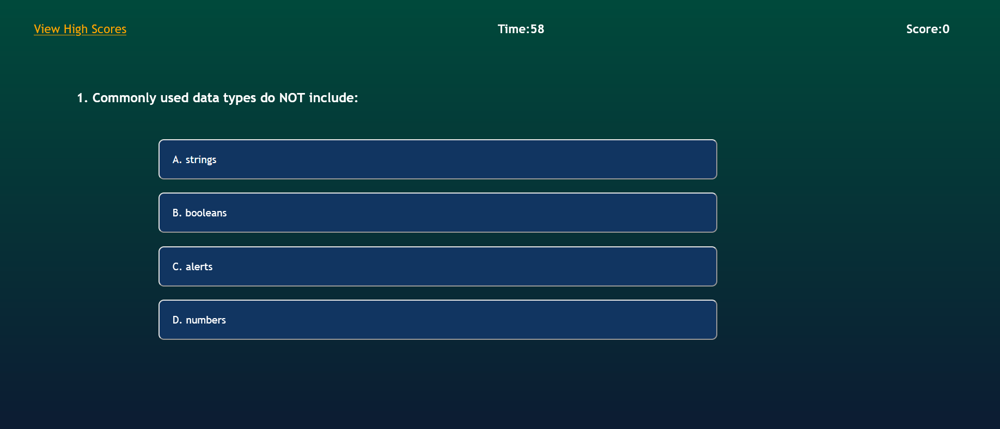

# Code Quiz

## Description
This code is used to create an interactive quiz used to test basic coding knowledge. The user can answer questions, save their score, and view previous high scores.

## Website Link
https://nataniel-c.github.io/code-quiz

## Website Screenshots

---

---

---